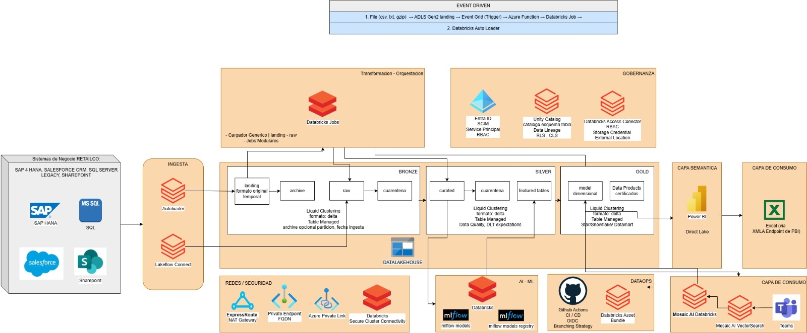

# Terraform Azure Databricks Private Workspace

## Overview

This repository contains the Infrastructure as Code (IaC) solution developed as part of a technical challenge for deploying a secure Azure Databricks environment using Terraform.

The solution provisions an enterprise-ready Azure Databricks Workspace with private networking, VNet Injection and Private Link connectivity following Microsoft recommended architecture.

## Solution Architecture

The deployed solution includes the following Azure resources:

- Azure Resource Group
- Virtual Network (VNet)
- Public Subnet (Databricks)
- Private Subnet (Databricks)
- Private Endpoint Subnet
- Network Security Group (NSG)
- Azure Databricks Premium Workspace
- Secure Cluster Connectivity (No Public IP)
- Front-End Private Endpoint
- Browser Authentication Private Endpoint
- Private DNS Zone
- Private DNS Zone Link

> **Reference Architecture diagram**



---

## Repository Structure

```text
terraform-azure-databricks-private-workspace
│
├── docs
│   ├── 01-Installation-and-Deployment-Runbook.md
│   ├── 02-Microsoft-EntraID-Permission-Strategy.md
│   └── images
│
└── terraform
    ├── providers.tf
    ├── variables.tf
    ├── main.tf
    ├── outputs.tf
    ├── environments
        ├── dev
    └── modules
        ├── network
        └── databricks
```

---

## Documentation

Additional project documentation is available under the **docs** directory.

| Document | Description |
|----------|-------------|
| 01-Installation-and-Deployment-Runbook.md | Deployment and installation procedure |
| 02-Microsoft-EntraID-Permission-Strategy.md | Microsoft Entra ID access strategy and RBAC matrix |

---

## Technologies

- Terraform
- Microsoft Azure
- Azure Databricks Premium
- Azure Virtual Network
- Azure Private Link
- Azure Private DNS
- Microsoft Entra ID

---

## Author

Christian Cullquicondo